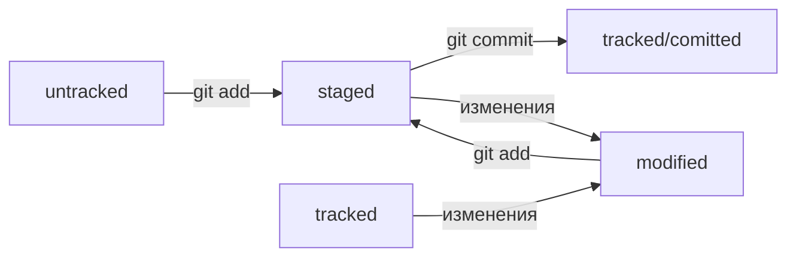

# Знакомство с git

## Основные команды

**pwd** - (от англ. print working directory — «показать рабочую папку») Она выводит путь к текущей директории

**cd** - (от англ. change directory — «сменить директорию»)  -  Сменить директорию. Если естьт пробелы, то пишем в ковычках.

* "~" - домашняя директория
* ".." - перейти на шаг назад

**ls** - (от англ. list directory contents — «отобразить содержимое директории») - вывести содержимое директории

Но можно вызвать ls с флагом -a и вывести расширенный список. В нём отобразятся все скрытые файлы, которые начинаются с символа . (например, файлы конфигурации).

```bash
ls #вывели список файлов
ls -a # вывели список, в котором отображаются скрытые файлы ., .. и .git
```

---

## Операции с папками и файлами: чтение и удаление


## Хеш

Хеш - идентификатор коммита. Git хранит инфу Хэш -> информация о коммите. Все хэши хранятся в служебном файле .git

Хеш позволяет узнать дату, автора и содержимое коммита.


## HEAD

HEAD - это служебный файл в папке .git. Он указывает на самый свежий коммит

Вместо хэша можно написать слово HEAD - git поймет

## Статусы в git

* untrucked - неотслеживаемый. Git видит файл, но не следит за ним. У него нет предыдущих версий

* staged - подготовленный. После git add файл попадает в taging area (index) т.е. в список файлов, которые попадут в commit

* tracked - противоположность untrucked. В него поппдают файлы, которые уже были зафиксированы с помощью git commit, а также после git add. Все файлы, в которых git отслеживает изменения

* modified - git сравнил содержимое файлов с последней сохр.версией и нашел отличия

**Схема статусов:**

modified+git add = staged

